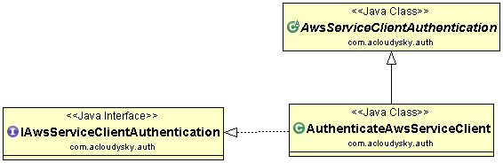

# aws-client-auth
 Creates an authenticated client which is allowed to use the selected service REST API. 
The following is the application class diagram: 

 
 
📝 You need to set up your AWS user's security credentials to be able to use the service REST API.
 
You do this by creating a file named **credentials** in the **~/.aws/** on Mac (*C:\Users\USER_NAME\.aws\* on Windows) and saving the following lines in the file:

	[default]
		aws_access_key_id = your access key
		aws_secret_access_key = your secret key

For more information, see [Providing AWS Credentials in the AWS SDK for Java](http://docs.aws.amazon.com/AWSSdkDocsJava/latest/DeveloperGuide/credentials.html) and [Welcome to Identity and Access Management](https://console.aws.amazon.com/iam/home?#security_credential).

🚨 To avoid accidental leakage of your credentials, DO NOT keep the credentials file in your source directory.

📝 At his time the application only provides authentication for EC2 and S3. New service authentication will be added.

## Create AWS Access Credentials
To access Amazon Web Services, you need an AWS account and AWS credentials. To increase the security of your AWS account, it is recommended to use an Identity Access Management (IAM) user to provide access credentials instead of using your root account credentials.

### Create IAM User Group
<ol>
	<li>In the AWS dashboard click on <strong>Services</strong>.</li>
	<li>In the <em>Security, Identity &amp; Compliance</em> section, select <strong>IAM</strong>.</li>
	<li>In the left pane, select the <strong>Groups </strong>menu item.</li>
	<li>In the upper left click the <strong>Create New Group </strong>button.</li>
	<li>Enter the name of the group.</li>
	<li>Select the Permissions if any you want to apply to the entire group. For instance <em>AmazonEC2 FullAccess</em>, We recommend you do not assign any permission, assign them on user's basis instead.</li>
	<li>Click the <strong>Next Step</strong> button.</li>
	<li>Review the group info, then click the <strong>Create Group</strong> button.</li>
</ol>

### Create Access and Secret Keys
<ol>
  <li>In the AWS dashboard click on <strong>Services</strong>.</li>
  <li>In the <em>Security, Identity &amp; Compliance</em> section, select <strong>IAM</strong>.</li>
  <li>In the left pane, select the <strong>Users</strong> menu item.</li>
  <li>In the upper left, click thje<strong> Add user</strong> button.</li>
  <li>In the <strong>User name</strong> box enter the name of your choosing.</li>
  <li>In the <em>Access type</em> section, check mark the <strong>Programmatic access</strong> box. 
	 This enable<strong> access key ID</strong> and <strong>secret access key</strong>
     for the AWS API, CLI, SDK, and other development tools.
  </li>
  <li>Click the <strong>Next Permissions</strong> button.</li>
  <li>At this point, you can add the user to an existing group (or create a new group).</li>
  <li>Select the group for the user.</li>
  <li>Click the <strong>Next Review</strong> button.</li>
  <li>Click the <strong>Create user</strong> button.</li>
  <li>In the bottom right, click the <strong>Close</strong> button.</li>
  <li>Click on the name of the user you just created.</li>
  <li>Click the <strong>Add permissions</strong> button.</li>
  <li>Select the <strong>Attach existing policies</strong> button.</li>
  <li>Search for one or more policy types you want to attach.</li>
  <li>Check mark the box on the left of the policy names.</li>
  <li>Click the <strong>Next Review</strong> button.</li>
  <li>Click the <strong>Add permissions</strong></li> button.</li>
  <li>Click the <strong>Security credentials</strong> tab.</li>
  <li>Click the <strong>Create access key</strong> button.</li>
  <li>In the pop-up window, click the <strong style="margin-left: 0.0px;">Donwload.csv file</strong> button. </li>
  <li>This downloads the <strong>accessKeys.csv</strong> file which contains the <strong>access key ID</strong> and <strong>secret access key</strong> to use in the <strong>credentials</strong> file.</li>
<li>Click the <strong>Close</strong> button.</li>
</ol>

----
### Usage
In your client application follow these steps:
 
- Instantiate the AuthenticateAwsServiceClient class.
- Obtain the authenticated client.

				
The following is an example:

		// Instantiate the AuthenticateAwsServiceClient class. 
		AuthenticateAwsServiceClient authClient = 
		new AuthenticateAwsServiceClient();
				
		// Get the authenticated client. 
		ec2Client = authClient.getAuthenticatedS3Client(currentRegion);

📝 When you build your client application, assure that you add this <b>aws-client-auth</b> program in your client application program path.

### References
- [Set up AWS Credentials for Development](http://docs.aws.amazon.com/java-sdk/latest/developer-guide/setup-credentials.html)
- [Getting Started with the AWS SDK for Java](http://aws.amazon.com/developers/getting-started/java/) 
- [Java Development Blog](http://java.awsblog.com/)

